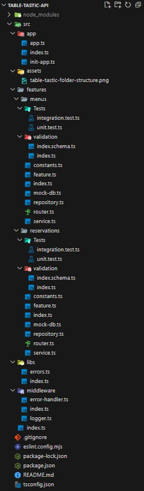

# Table Tastic

The ultimate table booking service for Very Important Persons...

## Big-picture plan

This assignment is part of the Salt JavaScript Fullstack Bootcamp, where we had the weekend to build a web API using Node Express.

I came up with the idea of building a web API to be used by both restaurant staff and Very Important Persons (VIPs). The restaurant staff updates the menus and the dishes offered at the restaurant via a web API endpoint. The users make reservations for an entire day at the restaurant via another web API endpoint.

The planning of the project can be found here:

[Planning board](https://github.com/users/CarlUdo/projects/2/views/1)

After finishing, the folder structure looks like this:

## Project requirements

- Create a public repository on your individual GitHub account.
- Set up a project planning board for the repository.
- Develop a big picture plan and add it to the readme in your repository.
- Write a backend API.
- Record a video presentation of your work and publish it on YouTube.

## Detiled requirements

- Implement at least two different application features. These features must not directly access each other's database data. If a feature needs data from another feature, it must call a service method from the other feature.
- Include routes for `get all`, `create`, `get by ID`, `delete`, and `update`.
- Maintain a tidy code architecture with good naming conventions, the use of factory functions, and simple, clean code
- Write at least one integration test per route.
- Include unit tests for the functional core.

## Preferred tech stack

- express.js,
- TypeScript,
- tsx,
- node.js test runner
- supertest,
- zod,
- uuid

## Table Tastic in detail

Please take a look at this program presentation to learn more about it. [Program presentation](https://youtu.be/BzWjhxE8Zr4) 
